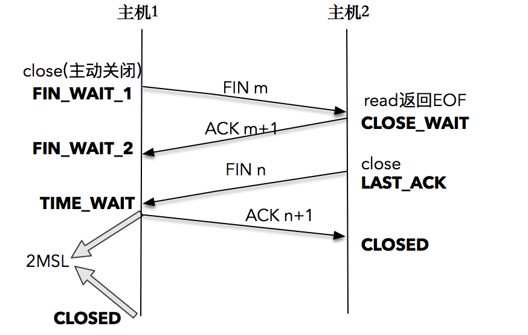

##　TIME_WAIT：隐藏在细节下的魔鬼

#### 1. TIME_WAIT发生的场景

* TCP四次挥手

  

1. TCP连接终止时(通常客户端应用程序close), 主机1先发送FIN报文,主机2进入CLOSE_WAIT状态,并发送一个ACK应答,同时主机2通过read调用获得EOF(read返回0),并将此结果通知应用程序进行主动关闭操作，发送FIN报文。
2. 主机1在收到FIN报文或发送ACK应答，此时主机1进入TIME_WAIT状态

主机1在TIME_WAIT停留的持续时间是固定的，是最长分节生命期的两倍，一般称之为2MSL。

Linux系统里有一个硬编码的字段，名称为TCP_TIMEWAIT_LEN，值为60秒，也就是说，Linux系统停留在TIME_WAIT的时间为固定的60秒。

**只有发起连接终止的一方才会进入TIME_WAIT状态**

#### 2. TIME_WAIT的作用

* 作用一：能够确保最后的ACK被被动关闭方接收到，从而帮助其正常关闭。

  TCP在设计的时候，充分考虑了容错设计，比如，TCP假设报文会出错，需要重传。如果主机1的ACK报文没有传输成功，那么主机2就会重新发送FIN报文。

  如果主机1没有维护TIME_WAIT状态，而直接进入CLOSED状态，它就失去了当前状态的上下文，只能回复一个RST操作，从而导致被动关闭方出现错误。

  现在主机1知道自己处于TIME_WAIT状态，就可以在接收到FIN报文后，重新发出一个ACK报文，使得主机2可以进入正常的CLOSED状态。

* 作用二：为了让旧连接的重复分节在网络中自然消失

基于上述两个作用，TCP设计出了TIME_WAIT机制，经过2MSL时间，足以让两个方向上的分组都被丢弃，使得原来连接的分组在网络中都自然消失。

**2MSL的时间是从主机1接收到FIN分节后发送ACK开始计时的**，

如果在TIME_WAIT时间内，因为主机1的ACK没有传输到主机2，主机1又接收到了主机2重发的FIN报文，那么2MSL的时间将重新计时。

#### 3. TIME_WAIT的危害

* 内存资源占用（基本可以忽略）

* 对端口资源的占用（主要影响）

  一个TCP连接至少占用一个本地端口。端口资源也是有限的，一般可以开启的端口为32768~61000，也可以通过net.ipv4.ip_local_port_range指定，如果TIME_WAIT状态过多，会导致无法创建新连接。

#### 4. 如何优化TIME_WAIT？

1. 通过sysctl命令修改`net.ipv4.tcp_max_tw_buckets`的值，将这个系统值调小，当系统中处于TIME_WAIT的连接一旦超过这个值时，系统将会把所有TIME_WAIT的连接状态重置（治标不治本）

2. 调小`TCP_TIMEWAIT_LEN`，重新编译内核

3. SO_LINGER的设置

   linger的英文意思是停留，