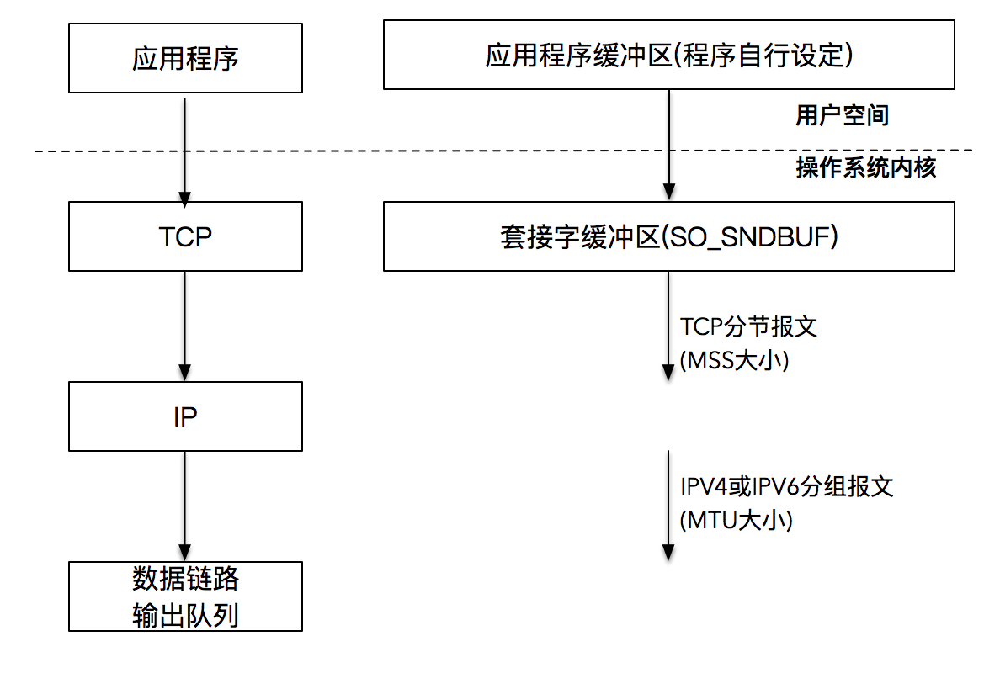

## 使用socket读写数据


#### 1. 读取数据

```c
ssize_t read(int sockfd, void *buffer, size_t size);
```

read函数从内核中通过sockfd读取最多size个字节，并将读取到的数据存储到buffer中。返回实际读取到的字节数。

返回值有3种情况：

1. 0 表示EOF，这在网络中表示对端发送了FIN包，要处理断线情况
2. -1 出错
3. 正整数n，表示实际读取到的字节数

当然，如果是非阻塞I/O，情况会略有不同。

注意，size表示最多读取size个字节。如果向让应用程序每次读取到size个字节，就需要循环读取。

```c
/*
 * 从sockfd描述符中读取size个字节
 */
ssize_t readn(int sockfd, void *vptr, size_t size) {
    size_t nleft;
    ssize_t nread;
    char *ptr = vptr;
    nleft = size;
    
    while (nleft > 0) {
        if ((nread = read(sockfd, ptr, nleft)) < 0) {
            if (errno == EINTR) {
                nread = 0; /* 这里需要继续read */
            } else {
                return -1;
            }
        } else if (nread == 0) {
            break; /* EOF, socket关闭 */
        } else {
            nleft -= nread;
            ptr += nread;
        }
    }
    return size - nleft;
}
```

#### 2. 读取缓冲区

#### 3. 发送数据

```c
ssize_t write(int sockfd, const void *buffer, size_t size);
ssize_t send(int sockfd, const void *buffer, size_t size, int flags);
ssize_t sendmsg(int sockfd, const struct msghdr *msg, int flags);
```

#### 4. 发送缓冲区

当TCP三次握手成功，TCP连接建立之后，内核会为每个连接创建配套的基础设施，比如**发送缓冲区**

当我们的应用程序调用write函数后，实际所做的事情就是把数据从应用程序中拷贝到内核的发送缓冲区中去，并不一定把数据通过socket发送到网络上。

write调用什么时候返回？

当应用程序给内核缓冲区发送数据，如果数据还没有发送完，或者数据发送完了，但是内核的发送缓冲区不足以容纳应用程序数据，在这种情况下，应用程序会阻塞在write调用。

当把应用程序的数据完全发送到内核的发送缓冲区，write调用会返回。注意，这时应用程序数据并没有全部被发送出去，发送缓冲区还有部分数据，这部分数据会在稍后由内核通过网络发送给客户端。



#### 5. 总结

1. 对于 send 来说，返回成功仅仅表示数据写到发送缓冲区成功，并不表示对端已经成功收到。
2. 对于 read 来说，需要循环读取数据，并且需要考虑 EOF 等异常条件。
3. **发送成功仅仅表示的是数据被拷贝到了发送缓冲区中，并不意味着连接对端已经收到所有的数据。至于什么时候发送到对端的接收缓冲区，或者更进一步说，什么时候被对方应用程序缓冲所接收，对我们而言完全都是透明的**

#### 6. 代码

**服务器程序**

```c
#include <stdio.h>
#include <stdlib.h>
#include <string.h>
#include <unistd.h>
#include <errno.h>
#include <sys/types.h>
#include <sys/socket.h>
#include <netinet/in.h>


ssize_t readn(int sockfd, void *vptr, size_t n);
ssize_t read_data(int sockfd);


int main(int argc, char *argv[])
{
    int listenfd, connfd;
    socklen_t clilen;

    if ((listenfd = socket(AF_INET, SOCK_STREAM, 0)) < 0) {
        perror("socket error\n");
        exit(EXIT_FAILURE);
    }

    struct sockaddr_in srvaddr, cliaddr;
    memset(&srvaddr, 0, sizeof(srvaddr));
    srvaddr.sin_family = AF_INET;
    srvaddr.sin_port = htons(12345);
    srvaddr.sin_addr.s_addr = htonl(INADDR_ANY);

    if (bind(listenfd, (struct sockaddr *)&srvaddr, sizeof(srvaddr)) < 0) {
        perror("bind error");
        exit(EXIT_FAILURE);
    }

    if (listen(listenfd, 5) < 0) {
        perror("listen error");
        exit(EXIT_FAILURE);
    }

    for ( ;; ) {
        clilen = sizeof(cliaddr);
        connfd = accept(listenfd, (struct sockaddr *)&cliaddr, &clilen);
        read_data(connfd);
        close(connfd);
    }

    
    return 0;
}


ssize_t readn(int sockfd, void *vptr, size_t n) {
    ssize_t nleft;
    ssize_t nread;
    char *ptr = (char *)vptr;

    while (nleft > 0) {
        nread = read(sockfd, ptr, nleft);
        if (nread < 0) {
            if (errno == EINTR) {
                nread = 0;
            } else {
                return -1;
            }
        } else if (nread == 0) {
            break;
        } else {
            nleft -= nread;
            ptr += nread;
        }
    }
    return n - nleft;
}


ssize_t read_data(int sockfd) {
    ssize_t n;
    char buf[1024];
    int time = 0;
    for ( ;; ) {
        fprintf(stdout, "block in read\n");
        if ((n = readn(sockfd, buf, 1024)) == 0) {
            return 0;
        }

        time++;
        fprintf(stdout, "1k read for %d\n", time);
        usleep(1000);
    }
    return 0;
}

```

客户端程序

```c
#include <stdio.h>
#include <stdlib.h>
#include <string.h>
#include <unistd.h>

#include <netinet/in.h>
#include <arpa/inet.h>
#include <sys/types.h>
#include <sys/socket.h>

#define SERVER_PORT 12345
#define MESSAGE_SIZE 1024000


ssize_t send_data(FILE *fp, int sockfd) {
    char *query;
    size_t remaining;
    size_t nwritten;
    query = (char *)malloc(MESSAGE_SIZE + 1);
    for (int i = 0; i < MESSAGE_SIZE; i++) {
        query[i] = 'a';
    }
    query[MESSAGE_SIZE] = '\0';

    const char *cp = query;
    remaining = strlen(query);
    while (remaining > 0) {
        nwritten = send(sockfd, cp, 1024, 0);
        fprintf(stdout, "send into buffer %ld \n", nwritten);
        if (nwritten <= 0) {
            perror("send error");
            return nwritten;
        }
        remaining -= nwritten;
        cp += nwritten;
    }
    return strlen(query) - remaining;
    
}

int main(int argc, char *argv[])
{
    if (argc != 2) {
        perror("usage: tcpclient <IPaddress>");
        exit(EXIT_FAILURE);
    }

    int sockfd;
    struct sockaddr_in servaddr;
    memset(&servaddr, 0, sizeof(servaddr));

    sockfd = socket(AF_INET, SOCK_STREAM, 0);
    servaddr.sin_family = AF_INET;
    servaddr.sin_port = htons(SERVER_PORT);

    inet_pton(AF_INET, argv[1], &servaddr.sin_addr);

    if (connect(sockfd, (struct sockaddr *)&servaddr, sizeof(servaddr)) < 0) {
        perror("connect error\n");
        exit(EXIT_FAILURE);
    }
    send_data(stdin, sockfd);
    
    return 0;
}

```

