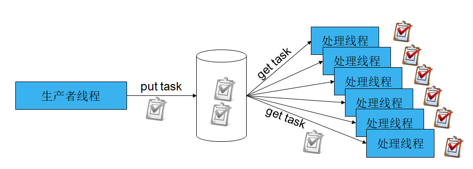

## 线程池设计

#### 1. 线程池解决什么问题？

* 阻塞调用（阻塞IO调用）
* 耗时的计算（读写文件、复杂的计算）
* 高密度任务（高并发低延时的网络IO请求）

如果临时创建线程来解决上面的问题，则会带来以下问题：

* 创建线程太多，浪费资源
* 创建线程太慢，导致执行任务结果返回慢
* 销毁线程太慢，可能影响其他进程使用资源

> 创建多个线程，放在池子里不销毁，把需要执行的任务交给线程池去执行，这就是线程池
>
> 任务由谁产生（生产者），如何丢给线程池的某个线程（消费者）？

#### 2. 线程池设计技术要点

1. 生产者与消费者采用什么方式进行同步？
2. 任务如何保存？
3. 生产者之间的同步方式，消费者之间的同步方式

#### 2. 条件变量结合互斥锁 + 任务队列的线程池设计



代码：

```c
typedef struct queue_task {
    void *(*run)(void *);
    void *arg;
} task_t;

typedef struct queue {
    int head;
    int tail;
    int size;
    int capcity;
    task_t *tasks;
} queue_t;

typedef struct async_queue {
    pthread_mutex_t mutex;
    pthread_cond_t cond;
    int		waiting_threads;
    queue_t *queue;
    int 	quit;  // 0 表示不退出 1 表示退出
    
    /* 调试变量 */
    long long tasked; // 已经处理完成的任务数量
} async_queue_t;
```

