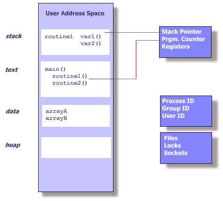

## 进程概念

#### 1. 一个进程中都有哪些信息？

* Process ID, process group ID, user ID, and group ID

* 环境
* 工作目录
* 程序指令
* 寄存器
* 栈、堆
* 文件描述符
* 信号执行动作
* 共享库
* 进程内部通信工具集，例如：msgqueue, pipe, semaphores, shm



#### 2. 线程中有哪些资源信息？

> 线程使用它们所属的进程资源，被操作系统调用。线程复制了进程一些必需的资源来支持他们作为可执行代码独立运行。这些必需的资源包括：
>
> * 栈指针
> * 寄存器
> * Scheduling properties，例如调度策略和调度优先级等
> * Set of pending and blocked signals
> * 线程特有的数据

#### 3. 为什么使用线程？

* 轻量 

  和进程相比，线程消耗的资源要远远小

* 线程间交换数据（通信）性能要比进程间交换数据更好

  进程间交换数据要进程间的内存拷贝，而线程间交换数据不需要，因为数据都是共享的

#### 4. 多线程要点

* 所有线程都可以访问进程内存，共享进程的内存资源
* 线程也有自己的私有数据
* 程序员负责对共享的数据进行同步

#### 5. 线程管理


##### 线程的join和detach状态（结合和分离）

在任何时间点，线程时可结合(joinable)或者可分离的(detached)

一个joinable的线程能够被其他线程收回其资源或者kill；在被其他线程回收之前，它的寄存器资源是不释放的。

相反，一个detached的线程时不能被其他线程回收或者kill的，它的寄存器资源在它终止时由系统自动释放。

> 总之，线程的分离状态决定一个线程以什么杨的方式来终止自己。
>
> 在默认情况下，线程是joinable，主线程等待创建的线程结束。只有当pthread_join返回时，创建的线程才算终止，才能释放自己占用的系统资源。而detached线程没有被其他线程等待，自己运行结束了，线程就终止，马上释放系统资源。		

​																																																	

###### API

* pthread_create

  ```c
  #include <pthread.h>
  int pthread_create(pthread_t *restrict tidp,
                    const pthread_attr_t *restrict attr,
                    void *(*start_routine)(void *), void * restrict arg);
  ```

  当pthread_create成功返回时，由tidp指向的内存单元被设置成新创建线程的tid。参数attr用于定制各种不同线程的属性，当设置成NULL时，创建默认属性的线程。当pthread_create失败时，会返回错误码。

  新创建的线程从start_routine函数开始执行，该函数只有一个无类型指针的参数arg，如果需要传递多个参数给start_routine，需要把所有的参数放到一个结构体中，然后把这个结构体的地址作为参数传入，最后在start_routine函数中强制转换成结构体。

* pthread_equal

  比较两个线程id是否相等，如果相等，则返回非零值。

* pthread_self

  返回系统唯一分配的当前按运行的线程id

* pthread_join

  ```c
  #include <pthread.h>
  int pthread_join(pthread_t thread, void **rval_ptr); 
  若成功则返回0；否则返回错误编号
  ```

  调用线程将一直阻塞，知道指定的线程调用pthread_exit、从启动例程中返回或者被取消

* pthread_exit

  ```c
  #include <pthread.h>
  void pthread_exit(void *rval_ptr);
  ```

  rval_ptr时一个无类型的指针，进程中的其他线程可以通过调用pthread_join函数访问到这个指针

  线程退出可以通过3种方式

  * 线程只是从启动例程总返回，返回值时线程的退出码
  * 线程可以被同意进程中的其他线程取消
  * 线程调用pthread_exit

* pthread_detach

  ```c
  #include <pthread.h>
  int pthread_detach(pthread_t tid);
  若成功返回0，否则返回错误编号
  ```

* pthread_cancel

  ```c
  #include <pthread.h>
  void pthread_cancel(pthread_t tid);
  ```

  pthread_cancel并不等待线程终止，它仅仅提出请求

* pthread_attr_setdetachstate

* pthread_attr_getdetachstate

* pthread_once

  ```c
  #include <pthread.h>
  int pthread_once(pthread_once_t *once_control,
             void (*init_routine)(void))
  ```

  pthread_once在进程中只执行一次init_routine方法，随后其他调用pthread_once将没有任何效果。

  once_control参数时一个同步控制结构体，要求在调用pthread_once函数之前必须初始化。

  `pthread_once_t once_control = PTHREAD_ONCE_INIT`

  

